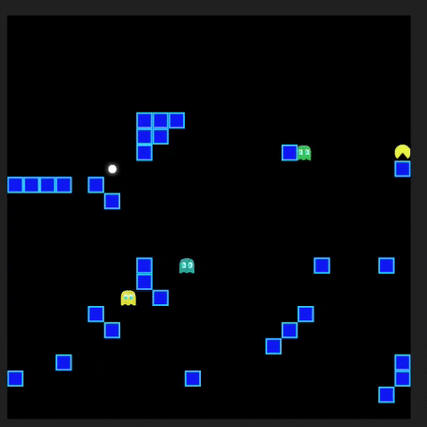

[contributors-shield]: https://img.shields.io/github/contributors/ludum-pro-bono/ludum-pro-bono-games.svg?style=for-the-badge
[contributors-url]: https://github.com/ludum-pro-bono/ludum-pro-bono-games/graphs/contributors
[forks-shield]: https://img.shields.io/github/forks/ludum-pro-bono/ludum-pro-bono-games.svg?style=for-the-badge
[forks-url]: https://github.com/ludum-pro-bono/ludum-pro-bono-games/network/members
[stars-shield]: https://img.shields.io/github/stars/ludum-pro-bono/ludum-pro-bono-games.svg?style=for-the-badge
[stars-url]: https://github.com/ludum-pro-bono/ludum-pro-bono-games/stargazers
[issues-shield]: https://img.shields.io/github/issues/ludum-pro-bono/ludum-pro-bono-games.svg?style=for-the-badge
[issues-url]: https://github.com/ludum-pro-bono/ludum-pro-bono-games/issues
[license-shield]: https://img.shields.io/github/license/ludum-pro-bono/ludum-pro-bono-games.svg?style=for-the-badge
[license-url]: https://github.com/ludum-pro-bono/ludum-pro-bono-games/blob/master/LICENSE.txt
[linkedin-shield]: https://img.shields.io/badge/-LinkedIn-black.svg?style=for-the-badge&logo=linkedin&colorB=555

[![Contributors][contributors-shield]][contributors-url]
[![Forks][forks-shield]][forks-url]
[![Stargazers][stars-shield]][stars-url]
[![Issues][issues-shield]][issues-url]
[![MIT License][license-shield]][license-url]

 
 

  

  <h3 align="center">Ludum pro bono</h3>

  

    Desenvolvimento e aplicação de jogos sérios relacionados a disciplinas do núcleo básico de graduações em engenharias
     
     
    <a href="https://ludum-pro-bono.github.io/ludum-pro-bono-frontend/menu/index.html">Acessar aplicação WEB</a>
    ·
    <a href="https://github.com/ludum-pro-bono/ludum-pro-bono-games/issues">Reportar Bug</a>
    ·
    <a href="https://github.com/ludum-pro-bono/ludum-pro-bono-games/issues">Sugerir funcionalidade</a>
  

 

# Índice
- [Sobre](#-sobre)
- [Tecnologias utilizadas](#-tecnologias-utilizadas)
- [Jogos](#-jogos)

# 🔖 Sobre

    O ensino de disciplinas relacionadas à programação e lógica apresentam uma série de desafios, principalmente relacionados a dificuldade dos alunos na associação de questões lógicas nas disciplinas iniciais de programação e dificuldade na aplicação de conceitos relacionados a estas disciplinas em problemas de outras áreas do conhecimento. Tal característica é intrínseca à área de computação, que é constantemente aplicada com outras disciplinas para a resolução de problemas. Este projeto apresenta a construção de jogos com foco na aprendizagem de lógica e algoritmos. Cada jogo desenvolvido abrange diferentes áreas do conhecimento, fazendo que o usuário aprenda o conteúdo abordado no jogo através de um processo divertido.

# 🚀 Tecnologias utilizadas

- [C#](https://docs.microsoft.com/pt-br/dotnet/csharp/)
- [Unity](https://unity.com/)

# 🎮 Jogos

- [Snake Calculator](#-snake-calculator)
- [Pacmaze](#-pacmaze)
- [Bomberdev](#-bomberdev)

## Snake Calculator

A mecânica de controle é feita a partir das setas direcionais, onde a serpente se movimenta na direção desejada a fim de coletar as comidas para realizar o cálculo. As comidas possuem diferentes cores que representam seus respectivos valores. A Snake pode passar pelos limites da tela reaparecendo na extremidade oposta da qual foi passada. A cada solução, o personagem aumenta de tamanho e são incrementados alguns segundos no tempo de jogo. O jogo é finalizado se o jogador colidir com seu próprio corpo ou o tempo acabar.

## Pacmaze

Pacmaze foi criado com o propósito de incentivar o estudo de algoritmos e estimular o raciocínio lógico. O jogador é apresentado à um labirinto e deve conduzir o personagem até o final do caminho, tendo de se precaver com as armadilhas e inimigos que tentarão impedir que o personagem avance para o próximo nível. 

## Bomberdev

Bomberdev tem como principal objetivo completar as fases destruindo obstáculos e inimigos em lugares estratégicos para alcançar a saída. Bomberdev tem como finalidade desenvolver o raciocínio lógico do jogador e, principalmente, suas habilidades algorítmicas, uma vez que é exigido montar uma estrutura de instruções que satisfaça os desafios da fase. 

